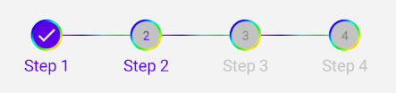

<div align="center">
  
</div>
<br>

<h1 align="center">Compose-Stepper</h1>
<h3 align="center">Compose-Stepper library provides a custom stepper in the modern android toolkit Jetpack compose which can be easily added in to your composable functions.</h3>
<br>


## Getting Started

[](https://jitpack.io/#maryamrzdh/compose-stepper)

Please get Android Studio Arctic Fox 2020.3.1 or above from here and use JDK 11 to build this project.

Add the following code to your project's _root_ `build.gradle` file:

```groovy
repositories {
    maven { url "https://jitpack.io" }
}
```

Next, add the dependency below to your _module_'s `build.gradle` file:

```gradle
dependencies {
	   implementation 'com.github.maryamrzdh:compose-stepper:1.0.0-beta01'
}
```

## Usage
Example is in the [source code](https://github.com/maryamrzdh/compose-stepper/blob/main/app/src/main/java/com/maryamrzdh/stepperview/MainActivity.kt).

### Basic

```kotlin

val numberStep = 4
var currentStep by rememberSaveable { mutableStateOf(1) }
val titleList= arrayListOf("Step 1","Step 2","Step 3","Step 4")

Stepper(
        numberOfSteps = numberStep,
        currentStep = currentStep,
        stepDescriptionList = titleList
) 

```


### Customizations

```kotlin

Stepper(
        modifier = Modifier.fillMaxWidth(),
        numberOfSteps = numberStep,
        currentStep = currentStep,
        stepDescriptionList = titleList,
        selectedColor = Color.Blue,
        unSelectedColor= Color.LightGray
)

```


```kotlin

Stepper(
        modifier = Modifier.fillMaxWidth(),
        numberOfSteps = numberStep,
        currentStep = currentStep,
        stepDescriptionList = titleList,
        isRainbow = true
)

```




## Medium Blog
For more info go to __[Stepper using JetPack Compose](https://medium.com/@maryamemarzadeh72/stepper-using-jetpack-compose-3765bce0f1b3)__


## Library Info
* Current version of the library needs targetSdk 33.

## Show some ❤ and support
Give a ⭐️ if this project helped you!
